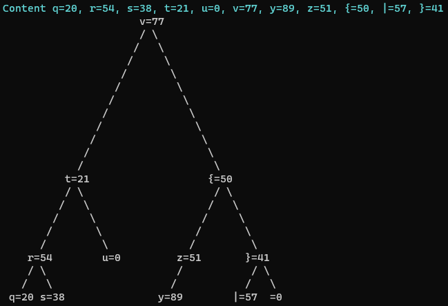
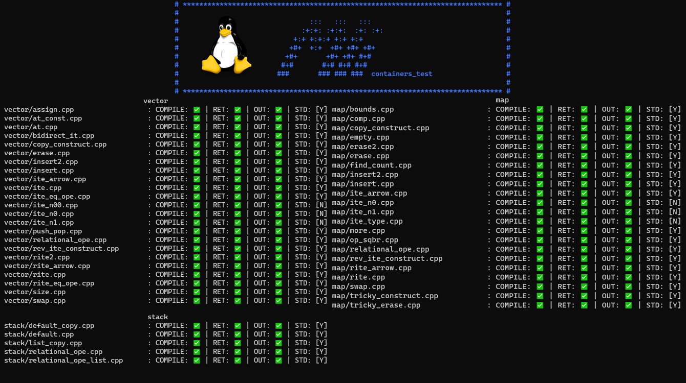

# ft_containers

## Vector
It is a dynamic array that tries not to allocate memory at each insertion. Vector contains many member functions.
## Stack
It is a container that contains a container: deque, list or vector.
## Map
It is a container that contains its values by keys. It is sorted according to the key, and the value is accessed using a key. 
Here is an example of a tree based on the AVL tree algorithm. This is how our keys and values are stored :

  

## Our Tester
`./test.sh`
It will display the result of some unit tests with our vector, stack, map then compare the output with the STL output. After that, it checks for leaks (valgrind on linux, leaks on macos).

## mli42's tester
`cd containers_test && ./do.sh vector stack map` \
It have many hard tests to check if it really work like STL does.
Result on Linux :

  

Tester repo : https://github.com/mli42/containers_test

### Score

