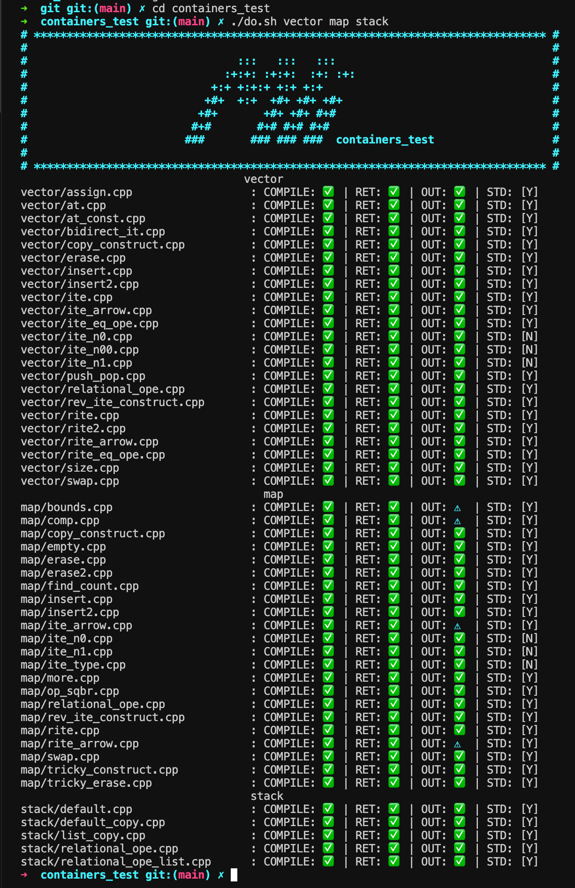

##### _Translations available_
<kbd></kbd>
#

# ft_containers

``ft_containers`` is 42 School project to learn how C++ containers are made.
Those containers are Vector, Map and Stack.
Coding it was about learning iterators purpose, templates in C++ and data structures such as AVL trees.
##### _Read the subject [here](subjects/en.subject.pdf)_

### Instructions

* Use ``test.sh`` command to test the containers. This test consists in comparing the Standard librairy containers with my own version using simple tests.
* Use ``cd containers_test && do.sh vector map stack`` (Thanks to mli42 for the tester) command to launch an other testing program using more elaborate test.